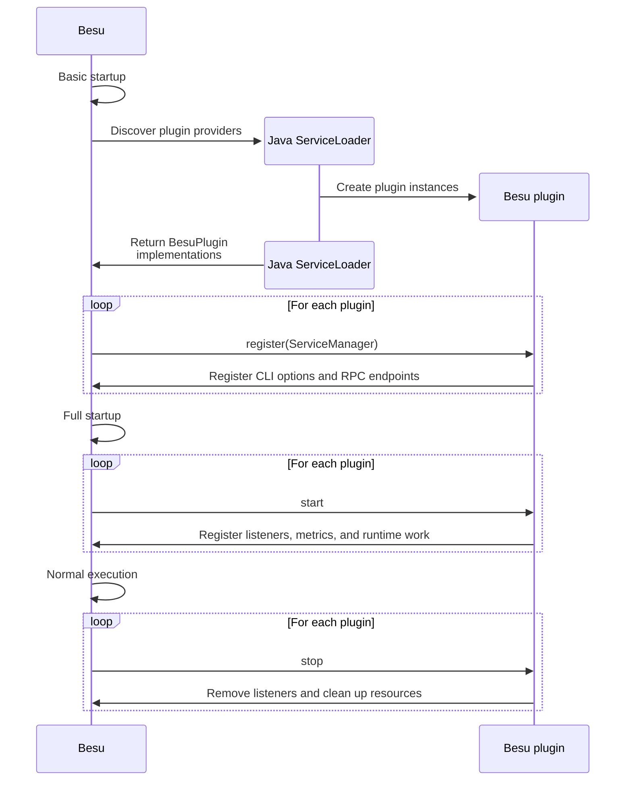

# Plugin lifecycle

A Besu plugin is a Java class that implements the [`BesuPlugin`](pathname:///plugins/reference/plugin-api/org/hyperledger/besu/plugin/BesuPlugin.html) interface.
Besu discovers plugin JARs using Java's `ServiceLoader`, then calls the plugin lifecycle methods during 
startup, runtime, reload, and shutdown.

## Lifecycle methods

| Method | Purpose |
| --- | --- |
| `getName` | Returns the plugin name. Besu uses this name for plugin-specific actions. The default is the plugin class name. |
| `register(ServiceManager)` | Called early in the Besu lifecycle. Store the [`ServiceManager`](pathname:///plugins/reference/plugin-api/org/hyperledger/besu/plugin/ServiceManager.html) and perform early registration such as CLI options and RPC endpoints. |
| `beforeExternalServices` | Optional hook called after Besu loads configuration and before external services (like metrics and HTTP) start. |
| `start` | Called after Besu loads configuration and starts external services, but before the main loop is up. Start runtime work here. |
| `afterExternalServicePostMainLoop` | Optional hook called after external services and main-loop setup. |
| `reloadConfiguration` | Optional hook called by the `plugins_reloadPluginConfig` RPC method. Implement it only for configuration that can be reloaded safely. |
| `stop` | Called when Besu shuts down or disables the plugin. Remove listeners and stop background work here. |
| `getVersion` | Returns plugin version information from package implementation metadata. |

## Lifecycle diagram

The following sequence diagram shows where plugin discovery and lifecycle callbacks fit into Besu startup,
normal execution, and shutdown.

## Service availability

Besu services are available at different parts of the plugin lifecycle.
Some are available and used in `register` before startup completes, and others interact with live data and are used in `start`.

[`PicoCLIOptions`](pathname:///plugins/reference/plugin-api/org/hyperledger/besu/plugin/services/PicoCLIOptions.html) and [`RpcEndpointService`](pathname:///plugins/reference/plugin-api/org/hyperledger/besu/plugin/services/RpcEndpointService.html) must be used in `register`.

The following services are typically used in `register`:

- [`BesuConfiguration`](pathname:///plugins/reference/plugin-api/org/hyperledger/besu/plugin/services/BesuConfiguration.html)
- [`MetricCategoryRegistry`](pathname:///plugins/reference/plugin-api/org/hyperledger/besu/plugin/services/metrics/MetricCategoryRegistry.html)
- [`PermissioningService`](pathname:///plugins/reference/plugin-api/org/hyperledger/besu/plugin/services/PermissioningService.html)
- [`SecurityModuleService`](pathname:///plugins/reference/plugin-api/org/hyperledger/besu/plugin/services/SecurityModuleService.html)
- [`TransactionPoolValidatorService`](pathname:///plugins/reference/plugin-api/org/hyperledger/besu/plugin/services/TransactionPoolValidatorService.html)
- [`TransactionSelectionService`](pathname:///plugins/reference/plugin-api/org/hyperledger/besu/plugin/services/TransactionSelectionService.html)
- [`TransactionValidatorService`](pathname:///plugins/reference/plugin-api/org/hyperledger/besu/plugin/services/TransactionValidatorService.html)

[`BlockchainService`](pathname:///plugins/reference/plugin-api/org/hyperledger/besu/plugin/services/BlockchainService.html) and [`TransactionSimulationService`](pathname:///plugins/reference/plugin-api/org/hyperledger/besu/plugin/services/TransactionSimulationService.html) are available at `register`, but typically used in `start`.

The remaining services only become available at `start`:

- [`BesuEvents`](pathname:///plugins/reference/plugin-api/org/hyperledger/besu/plugin/services/BesuEvents.html)
- [`BftQueryService`](pathname:///plugins/reference/plugin-api/org/hyperledger/besu/plugin/services/query/BftQueryService.html)
- [`BlockSimulationService`](pathname:///plugins/reference/plugin-api/org/hyperledger/besu/plugin/services/BlockSimulationService.html)
- [`MetricsSystem`](pathname:///plugins/reference/plugin-api/org/hyperledger/besu/plugin/services/MetricsSystem.html)
- [`MiningService`](pathname:///plugins/reference/plugin-api/org/hyperledger/besu/plugin/services/mining/MiningService.html)
- [`P2PService`](pathname:///plugins/reference/plugin-api/org/hyperledger/besu/plugin/services/p2p/P2PService.html)
- [`PoaQueryService`](pathname:///plugins/reference/plugin-api/org/hyperledger/besu/plugin/services/query/PoaQueryService.html)
- [`RlpConverterService`](pathname:///plugins/reference/plugin-api/org/hyperledger/besu/plugin/services/rlp/RlpConverterService.html)
- [`SynchronizationService`](pathname:///plugins/reference/plugin-api/org/hyperledger/besu/plugin/services/sync/SynchronizationService.html)
- [`TraceService`](pathname:///plugins/reference/plugin-api/org/hyperledger/besu/plugin/services/TraceService.html)
- [`TransactionPoolService`](pathname:///plugins/reference/plugin-api/org/hyperledger/besu/plugin/services/transactionpool/TransactionPoolService.html)
- [`WorldStateService`](pathname:///plugins/reference/plugin-api/org/hyperledger/besu/plugin/services/WorldStateService.html)
