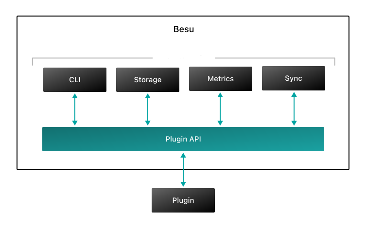

# Besu plugins

Besu plugins are Java extensions that add custom functionality to Besu without changing Besu source code.

Plugins are built using the [Plugin API](pathname:///plugins/reference/plugin-api/index.html), which provides
services for interacting with Besu.
Using these services, plugins can query Besu state, configure behavior, extend or replace parts of Besu, and listen
for events such as block imports and transaction pool changes.

You can create your own plugin to build app-specific chains, integrate Besu with enterprise systems,
observe blockchain activity, analyze transactions, support Layer 2 networks, or add debugging and
operational tooling.

Get started with the [quickstart](get-started/quickstart.md), or explore the
[plugin lifecycle](get-started/plugin-lifecycle.md) and [plugin services](/plugins/services).

## Architecture

The following diagram illustrates some of the services exposed by the Plugin API.

If you have questions about creating or using Besu plugins, ask on the **besu** channel on
[Discord](https://discord.gg/hyperledger).
