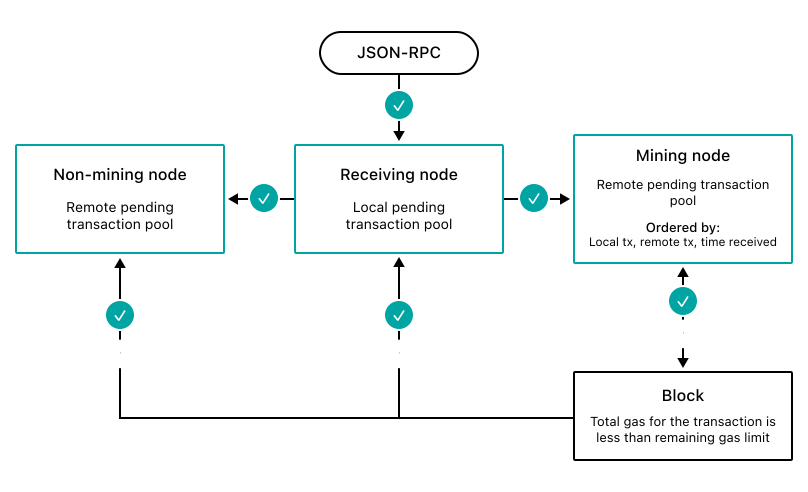

# Transaction validation

For each transaction submitted and added to a block, Besu checks the following:

- The nonce is high enough.
- Permissions are correct.
- The transaction is well formed.
- The sender is valid.
- There is a sufficient account balance.
- The chain ID is correct.
- The gas limit is high enough.

The following diagram illustrates when Besu validates transactions (indicated by a check mark):

Besu repeats the set of transaction pool validations after propagating the transaction. Besu repeats the same set of validations when importing the block that includes the transaction, except the nonce must be exactly right when importing the block.

When adding the transaction to a block, Besu performs an additional validation to check that the transaction gas limit is less than the remaining block gas limit. After creating a block, the node imports the block and then repeats the transaction pool validations.

:::info

The transaction is only added if the entire transaction gas limit is less than the remaining gas for the block. The total gas used by the transaction is not relevant to this validation. That is, if the total gas used by the transaction is less than the remaining block gas, but the transaction gas limit is more than the remaining block gas, the transaction is not added.

:::
